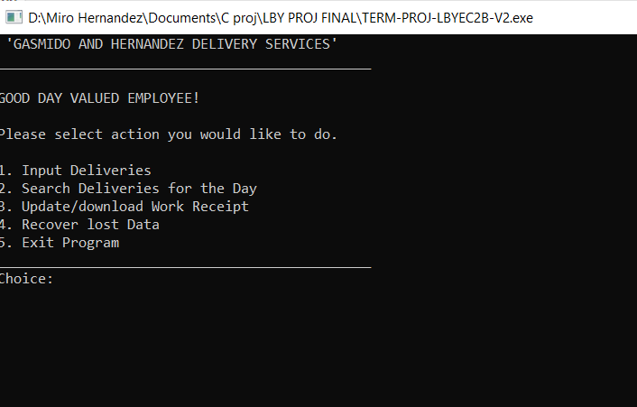
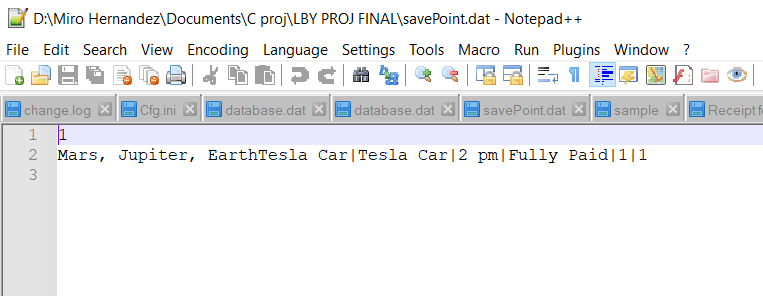

# Gasmido and Hernandez Delivery Services

A simple C++ console-based delivery schedule application designed to record and manage courier delivery tasks for the day. The program allows inputting deliveries, searching records, generating work receipts, and recovering saved data.

## Features

- 📦 **Input Deliveries**: Add delivery details including item, address, time, comments, order number, and quantity.
- 🔍 **Search Deliveries**: Lookup delivery details by item name.
- 🧾 **Generate Receipts**: Print and save a detailed receipt of the day’s deliveries.
- 💾 **Data Recovery**: Recover lost data from the save point (`savePoint.dat`).
- 🚪 **Exit Option**: Graceful program termination.

## Getting Started

### Prerequisites

- C++ compiler (e.g., g++, clang++)
- Windows terminal (uses `system("CLS")` and `system("Pause")`)

### Compilation

```bash
g++ -o delivery_app TERM-PROJ-LBYEC2B-V2.cpp
```

### Running
```
./delivery_app
```

### Demo



### Authors
- Miro Hernandez
- Joaquin Gasmido
